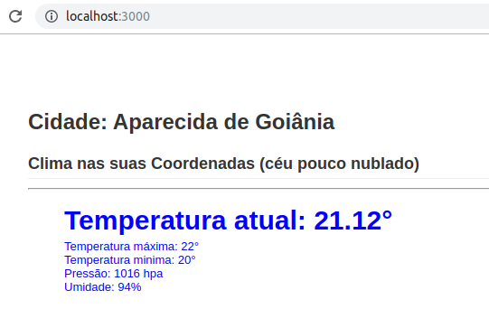

# Consumindo APIs externas no React (Exibindo o clima local)

> Consumir APIs externas é algo fundamental para a maior parte dos APPs, por isto, neste artigo você vai aprender como criar um APP React que consome uma API de previsão do tempo de forma fácil e rápida.

> O APP que iremos construir vai solicitar ao usuário a permissão para saber a localização dele pelo browser, depois com essas coordenadas nós vamos chamar a API do Open Wheater Map para pegar a previsão do clima para aquele local e por fim exibiremos essas informações na tela para o usuário.

## Pontos que vamos aprender:
   
- 1 Consumo de APIs externas no React
- 2 Como pegar a localização do usuário
- 3 Como usar Hooks na prática
- 4 Como utilizar variáveis de ambiente
# Criando as credenciais do Open Wheater
> Visite o site https://openweathermap.org e crie sua conta, depois acesse sua API Key (nessa URL), ela será necessária para nos conectarmos ao Open Wheather Map.
  Após criar a API Key você deve esperar alguns minutos para que ela seja ativada (para mim demorou 15 minutos), após isso você já pode utiliza-la 😁
 ```
 npm i -g create-react-app
 ```
  
  This project was bootstrapped with [Create React App](https://github.com/facebook/create-react-app).
    
  ## Available Scripts
  
  In the project directory, you can run:
  
  ### `npm start`
  
  Runs the app in the development mode.<br>
  Open [http://localhost:3000](http://localhost:3000) to view it in the browser.
  
  The page will reload if you make edits.<br>
  You will also see any lint errors in the console.
  
  ### `npm test`
  
  Launches the test runner in the interactive watch mode.<br>
  See the section about [running tests](https://facebook.github.io/create-react-app/docs/running-tests) for more information.
  
  ### `npm run build`
  
  Builds the app for production to the `build` folder.<br>
  It correctly bundles React in production mode and optimizes the build for the best performance.
  
  The build is minified and the filenames include the hashes.<br>
  Your app is ready to be deployed!
  
  See the section about [deployment](https://facebook.github.io/create-react-app/docs/deployment) for more information.
  
  ### `npm run eject`
  
  **Note: this is a one-way operation. Once you `eject`, you can’t go back!**
  
  If you aren’t satisfied with the build tool and configuration choices, you can `eject` at any time. This command will remove the single build dependency from your project.
  
  Instead, it will copy all the configuration files and the transitive dependencies (Webpack, Babel, ESLint, etc) right into your project so you have full control over them. All of the commands except `eject` will still work, but they will point to the copied scripts so you can tweak them. At this point you’re on your own.
  
  You don’t have to ever use `eject`. The curated feature set is suitable for small and middle deployments, and you shouldn’t feel obligated to use this feature. However we understand that this tool wouldn’t be useful if you couldn’t customize it when you are ready for it.
  
  ## Learn More
  
  You can learn more in the [Create React App documentation](https://facebook.github.io/create-react-app/docs/getting-started).
  
  To learn React, check out the [React documentation](https://reactjs.org/).
  
  ### Code Splitting
  
  This section has moved here: https://facebook.github.io/create-react-app/docs/code-splitting
  
  ### Analyzing the Bundle Size
  
  This section has moved here: https://facebook.github.io/create-react-app/docs/analyzing-the-bundle-size
  
  ### Making a Progressive Web App
  
  This section has moved here: https://facebook.github.io/create-react-app/docs/making-a-progressive-web-app
  
  ### Advanced Configuration
  
  This section has moved here: https://facebook.github.io/create-react-app/docs/advanced-configuration
  
  ### Deployment
  
  This section has moved here: https://facebook.github.io/create-react-app/docs/deployment
  
  ### `npm run build` fails to minify
  
  This section has moved here: https://facebook.github.io/create-react-app/docs/troubleshooting#npm-run-build-fails-to-minify

  * To run the project locally use following commands
  ``` 
  build react bundle from scratch
  
  	- > install create-react-app globally
  
  1)>> npm install -g create-react-app
  
  	- > create your app
  
  2)>> create-react-app <app-name>
  
      - > go to the created app folder
  
  3)>> cd <app-name>
  
  	- > install npm modules
  
  4)>> npm install 
  
  	- > run your app server
  
  5)>> npm run start
  
  Note: to run a backend server, open a new terminal >>> run 
  	
      >> node server.js
  
  Install npm packages you need to develop react app
  
  	- > install Prop-types
  
  1)>> npm install --save prop-types
  
      - > install escape-string-regexp
  
  2)>> npm install --save escape-string-regexp
  	
      - > install sort-by
  
  3)>> npm install --save sort-by
  
      - > install react-router-dom
      
  4)>> npm install --save react-router-dom
  	
      - > install react-router
  
  5)>> npm install --save react-router
  
  Note: to run all at once
  
  >> npm install --save prop-types escape-string-regexp sort-by react-router-dom react-router
  
  ``` 
- https://necolas.github.io/react-native-web/docs/?path=/docs/overview-getting-started--page
